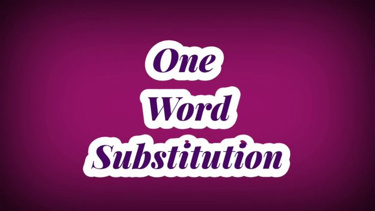
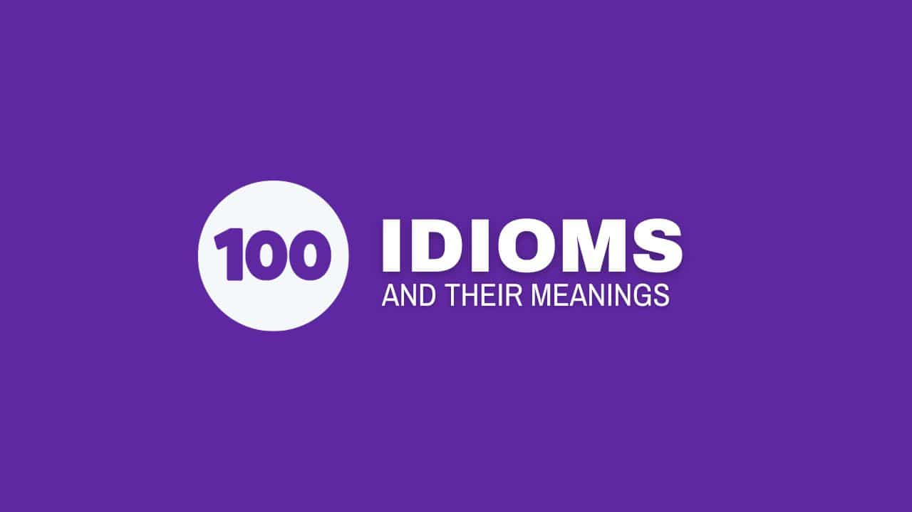
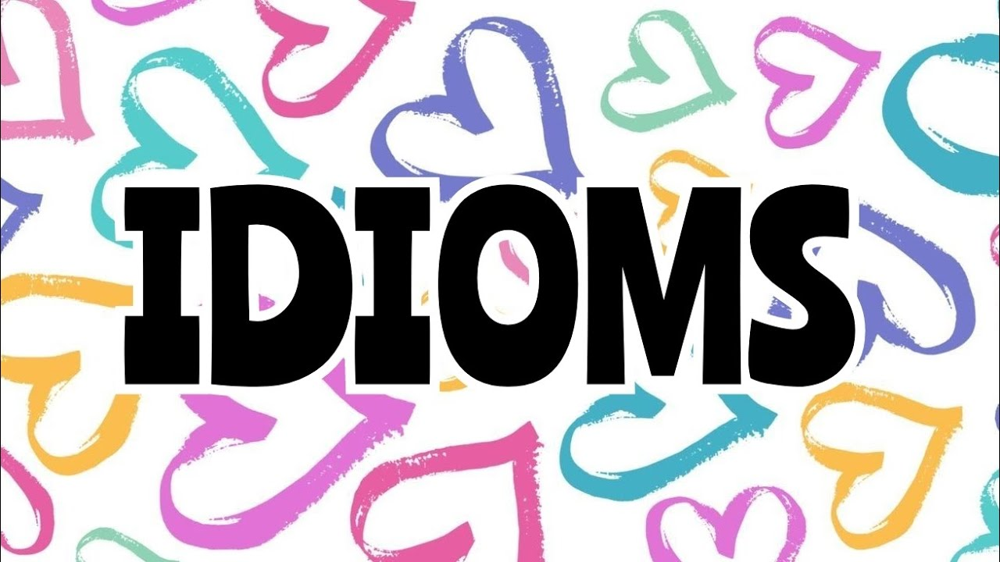

# ONE WORD SUBSTITUTION

| Sr| Sentence| One word |
|---------|----------|-------|
| 1. | A partner in crime: | **Accomplice** |
| 2. | Written declaration made on an oath:| **Affidavit** |
| 3. | A list of things to be discussed at a meeting:| **Agenda** |
| 4. | One who doubts the existence of God:| **Agnostic/Atheist** |
| 5. | One who is a habitual drunkard: |**Alcoholic**|
| 6. | A legal defence by which an accused person tries to show that he was somewhere else when the crime was committed:| **Alibi** |
| 7. | A person who lives in a foreign country:| **Alien** |
| 8. | One who takes part in sports and other activities for enjoyment only: | **Amateur** |
| 9. | A statement that is open to more than one interpretation:  | **Ambiguous** |
| 10. | A general pardon of political offender:| **Amnesty** |
| 11. | One who is out to destroy the government:| **Anarchist**|
| 12. | Absence of government:| **Anarchy** |
| 13. |  The science of the  structure of human body: | **Anatomy** |
| 14. | An instrument used for measuring force of the wind: | **Anemometer** | 
| 15. |  Medicine which produces insensitivity: | **Anaesthetic** |
| 16. | A book written by an unknown author:| **Anonymous** |
| 17. |The study of man:| **Anthropology** |
| 18. |  A medicine used to counteract poison:| **Antidote** | 
| 19. | One who studies things of the past: | **Antiquarian** |
| 20. |  A substance which kills germs: | **Antiseptic** |
| 21. |  An artificial pond or a tank used for keeping live fish, water plants, etc. | **Aquarium** |
| 22. |  A study of ancient things: | **Archaeology** | 
| 23. |One who prepares plans for buildings: | **Architect** |
| 24. | A place where government and public records are kept: | **Archive** |
| 25. | A government by the nobility: | **Aristocracy** |
| 26. | A study of stars and planets and their influence on human affairs: |**Astrology**|
| 27. | One who flies a space vehicle: | **Astronaut** |
| 28. | The study of stars: | **Astronomy** |
| 29. |  Animals that live in water: | **Aquatic** |
| 30. | Space or room which is immediately below the roof of a house:| **Attic** |
| 31. | Something that can be heard: | **Audible** |
| 32. | A record of one's life written by oneself:| **Autobiography** |
| 33. | A government by one: | **Autocracy** |
| 34. | The right of self-government: | **Autonomy** | 
| 35. | A place for keeping birds: | **Aviary** |
| 36. | An unmarried man: | **Bachelor** |
| 37. | One who is unable to pay off one's debt: | **Bankrupt** |
| 38. | A building used for lodging soldiers: | **Barrack** |
| 39. | Hastily erected barrier across a street: | **Barricade** | 
| 40. | One who is engaged to be married: | **Betrothed** |
| 41. | A great lover of books: | **Bibliophile** | 
| 42. | One who can speak two languages: | **Bilingual** | 
| 43. | An instrument used by both the eyes to see a distant object in an increased shape: | **Binocular** |
| 44. | A record of one's life written by somebody else: | **Biography** |
| 45. | A study of plants: | **Botany** |
| 46. | A bunch of flowers: | **Bouquet** |
| 47. | A collection of flags: | **Bunting** |
| 48. | A government by the officials: | **Bureaucracy** | 
| 49. | A list which contains dates and days: | **Calendar** |
| 50. | The art of beautiful writing: | **Calligraphy** | 
| 51. | One who eats human flesh: | **Cannibal** |
| 52. | The dead body of an animal: | **Carcass** |
| 53. | One who lives on flesh: | **Carnivorous** |
| 54. | A place with gambling tables: | **Casino** |
| 55. | Soldiers on horses: | **Cavalry** |
| 56. | One who is unmarried: | **Celibate** |
| 57. | One who is more than hundred years old: | **Centenarian** |
| 58. | Situation in which everything happens in a confused way: | **Chaotic** |
| 59. | One who mends shoes: | **Cobbler** |
| 60. | People who work together: | **Colleagues** |
| 61. | A person belonging to one's own country: | **Compatriot** |
| 62. | One who is completely self-satisfied: | **Complacent** |
| 63. | One who sells sweets and pastries: | **Confectioner** |
| 64. | Belonging to an individual from birth: | **Congenital** |
| 65. | One who believes in keeping things and customs as they are: | **Conservative** |
| 66. | A  number of stars grouped together: | **Constellation** |
| 67. | Smuggled goods: | **Contraband** | 
| 68. | One who lives at the same time: | **Contemporary** | 
| 69. | One for whom the world is home: | **Cosmopolitan** |
| 70. | One who easily believes what others say: | **Credulous** |
| 71. | A number of sailors working on a ship: | **Crew** |
| 72. | A war of religion: | **Crusade** |
| 73. | One who questions everything: | **Cynic** |
| 74. | A person who has been appointed or selected to attend or speak at a conference: | **Delegate** |
| 75. | A government by the people: | **Democracy** | 
| 76. | A language of a region with its own way: | **Dialect** |
| 77. | Shy, timid unwilling to face a situation: | **Diffident** |
| 78. | A book which contains telephone addresses: | **Directory** |  
| 79. | A game in which no one wins: | **Draw** |
| 80. | Extremely dry weather without rainfall: | **Drought** |
| 81. | One who deals in cattle: | **Drover** |
| 82. |  A person who is slow in learning: | **Dunce** |
| 83. | One who has strange habits: | **Eccentric** |
| 84. | Something that can be eaten: | **Edible** |
| 85. | One who thinks and talks too much about himself/herself: | **Egoist** | 
| 86. |  A poem written to mourn the death of someone: | **Elegy** |
| 87. | The most capable part of group, class of society or a country: | **Elite** |
| 88. | The art of effective speaking: | **Elocution** |
| 89. | One who is given to the pleasures of flesh: | **Epicure** |
| 90. | A book containing information on all branches of knowledge: | **Encyclopaedia** |
| 91. | A speech made by the dramatist at the end of the play: | **Epilogue** | 
| 92. | Words inscribed on a tomb about the person buried therein: | **Epitaph** | 
| 93. | A statement open to more than one interpretations: | **Equivocal** |
| 94. | The act of spying: | **Espionage** |
| 95. | A study of the origin of words: | **Etymology** |
| 96. | To shift people from a place of danger to a safer place: | **Evacuate** |
| 97. | A speech made without preparation: | **Extempore** |
| 98. | Short stories with an element of moral: | **Fable** | 
| 99. | One who is not easily pleased: | **Fastidious** |
| 100. | A disease which ends in death: | **Fatal** |
| 101. | One who believes in fate: | **Fatalist** |
| 102. | Animals of a certain region: | **Fauna** |
| 103. | One who champions the rights of women: | **Feminist** | 
| 104. | One who is engaged to marry: | **Fiancé/Fiancée** |
| 105. | A person with showy character: | **Flamboyant** |
| 106. | A number of battle ships: | **Fleet** |
| 107. | A number of sheep: | **Flock** |
| 108. | Plants and vegetation of a certain region: | **Flora** |
| 109. | Murder of a brother: | **Fratricide** |
| 110. | Large band of stars encircling the heavens: | **Galaxy** | 
| 111. | The study of rocks and soil: | **Geology** | 
| 112. | One who eats too much: | **Glutton** |

# IDIOMS AND THEIR MEANINGS:

1. A bed of roses: A comfortable position.

2. A bed of thorns: An uncomfortable position.

3. A bird in the hand is worth two in the bush: Having something that is certain is much better than taking a risk for more.

4. A bird's eye view: A brief general view.

5. A blessing in disguise: Something good that isn't recognized at first. 

6. A bolt from the blue: Any calamity that overtakes somebody suddenly.

7. A chicken-hearted fellow: A timid person.

8. Achilles heel: A point of vulnerability.

9. A doubting Thomas: A skeptic who needs physical or personal evidence to believe something.

10. A drop in the bucket: A very small part of something.

11. A fair weather friend: One who betrays in difficulty.

12. A fish out of water: A person in uncomfortable surroundings.

13. A fool and his money are easily parted: It is easy for a foolish person to lose his/her money.

14. A hen-pecked husband: A person servile to his wife.

15. A leopard can't change his spots: You cannot change what you are.

16. A penny saved is a penny earned: Saving money little by little.

17. A picture paints a thousand words: A visual presentation is far more descriptive than words. 

18. A piece of cake: A task that can be accomplished very easily.

19. A red letter day: An important day.

20. A slap on the wrist: A very mild punishment.

21. A snake in grass: A deceitful person.

22. A taste of your own medicine: When you are ill-treated the same way you ill-treat others.

23. At loggerheads: Engaged in a head-on dispute.

24. Actions speak louder than words: It's better to do something in reality than just talk about it.

25. Add fuel to the fire: To do something to make a bad situation even worse than it is.

26. Against the clock: To do something fast to finish it before a particular time. 

27. All bark and no bite: Someone is threatening or aggressive but not willing to engage in a fight.

28. All Greek to me: Meaningless and incomprehensible like someone who cannot read, speak, or understand any of the Greek languages.

29. All in the same boat: When everyone is facing the same challenges, p

30. An axe to grind: To have a dispute with someone.

31. An apple of someone's eye: Someone who is cherished above all others.

32. As high as a kite: Anything that is high up in the sky.

33. At the drop of a hat: Willing to do something immediately.

34. Back-seat driver: People who criticize from the sidelines, much like someone giving unwant advice from the back seat of a vehicle to the driver.

35. Back to square one: Having to start all over again.

36. Beat a dead horse: To force an issue that has already ended.

37. Beating about the bush: Avoiding the main topic. Not speaking directly about the issue.

38. Between a rock and a hard place: Stuck between two very bad options.

39. Bite off more than you can chew: To take on a task that is way to big.

40. Bite your tongue: To avoid talking.

41. Black sheep: A person who is considered a disgrace to a family.

42. Blood is thicker than water: The family bond is closer than anything else.

43. Blow one's own horn: To praise your own abilities and achievements.

44. Blue moon: A rare event or occurrence.

45. Break the ice: To remove the tension, hesitation at the first meeting or at the opening of a party, etc.

46. Burn the midnight oil: To stay awake late at night to work or to study.

47. By hook or by crook: By whatever means possible, fair or unfair.

48. Carry a torch: To be infatuated with.

49. Chew someone out: To scold someone verbally.

50. Chip on his shoulder: Angry today about something that occurred in the past.

51. Chip off the old block: People who closely resemble their parents in some way or the other.

52. Clean slate: To make a new start by clearing records.

53. Cock and bull story: An unbelievable tale.

54. Crocodile tears: Pretending to be sad, in an attempt to manipulate the situation.

55. Cross your fingers: To hope that something happens the way you want it to.

56. Cry over spilt milk: When you complain about a loss from the past.

57. Cry wolf: Intentionally raise a false alarm.

58. Curiosity killed the cat: Being inquisitive can lead you into a dangerous situation. 

59. Dark horse: One who was previously unknown and is now prominent.  

60. Devil's advocate: Someone who takes a position for the sake of argument without believingin
that particular side of the argument. 

1.   Don't count your chickens before they hatch: Don't rely on something until you are sure of it.

2.   Don't put all your eggs in one basket: Do not put all your resources in one possibility. 

3.   Drastic times call for drastic measures: When you are extremely desperate you need to take extremely desperate actions.

4.   Draw the line: To set a limit, as of accepted behaviour.

5.   Drink like a fish: To drink very heavily.

6.   Drive someone up the wall: To irritate and/or annoy very much. 

7.   Dropping like flies: A large number of people either falling ill or dying. 

8.   Every cloud has a silver lining: Be optimistic, even difficult times will lead to better days.

9.   Everything but the kitchen sinks: Almost everything and anything has been included. 

10.  Eye for eye: Revenge.

11. Feather in one's hat: An accomplishment a person can be proud of.

12. Field day: An enjoyable day or circumstance.

13. Finding your feet: To become more comfortable in whatever you are doing.

14. Fixed in your ways: Not willing to change from your normal way of doing something.

15. Flash in the pan: Something that looks promising in the beginning but fails to deliver anything in the end.

16. Flesh and blood: Material of which people are made of, or it can refer to someone's family.

17. Fools'gold: A worthless rock that resembles real gold.

18. From pillar to post: From one place or thing to another.

19. From rags to riches: To go from being very poor to being very wealthy.

20. Fuddy-duddy: An old-fashioned and foolish type of person. 

21. Get over it: To move beyond something that is bothering you.

22. Get up on the wrong side of the bed: Someone who has a horrible day.

23. Give him the slip: To get away from, to escape.

24. Go down like a lead balloon: To be received badly by an audience.

25. Go out on a limb: Put yourself in a tough position to support someone/something.

26. Go the extra mile: Making extra efforts for the task at hand.

27. Good Samaritan: reward. Someone who helps others when they are in need with no thought of a

28. Great minds think alike: Intelligent people think like each other.

29. Green room: The waiting room, especially for those who are about to go on stage. a TV or radio.

30. Gut feeling: A personal intuition that something may not be right.

31. Haste makes waste: Quickly doing things results in a poor ending.

32. Hat trick: Three scores made continuously without break in a sport, such as three wickets in cricket or three soccer goals.

33. Have a finger in every pie: To be involved in a lot of different activities and have influence over them.

34. He lost his head: Angry and overcome by emotions.

35. Head over heels: Very excited and/or joyful, especially when in love.

36. Hell in a hand basket: Deteriorating and headed for complete disaster.

37. Hit below the belt: An unfair or cruel remark.

38. Hit the books: To study, especially for a test or exam.

39. Hit the nail on the head: Do something exactly right or say something exactly right.

40.  Hold your horses: Be patient. 

41.  Icing on the cake: Something extra that is added to an already good situation.

42.  Idle hands are the devil's tools: You are more likely to get into trouble if you have nothing to do.

43.  If it's not one thing, it's another: When one thing goes wrong, then another, and another. 

44.  In the heat of the moment: Overwhelmed by what is happening in the moment.

45.  It takes two to tango: A two-person conflict where both people are at fault.

46.  It's a small world: You frequently see the same people in different places. 

47.  It's anyone's call: A competition where the outcome is difficult to judge or predict.

48.   Jack of all trades master of none: Someone good at many things but excellent at nothing.

49.   Keep an eye on somebody: You should watch a person carefully.

50.   Keep body and soul together: To earn a sufficient amount of money to keep yourself alive.

51.   Keep your chin up: To remain joyful in a tough situation.

# SENTENCES FOR IDIOMS:

| Sr. | **Idiom**                              | **Sentence 1**                                                                              | **Sentence 2**                                                                                |
|-----|----------------------------------------|---------------------------------------------------------------------------------------------|------------------------------------------------------------------------------------------------|
| 1. | **A bed of roses**                     | Life is not always a bed of roses.                                                          | He thought the job would be a bed of roses, but it was very challenging.                        |
| 2. | **A bed of thorns**                    | The new manager's role felt like a bed of thorns.                                            | She found herself in a bed of thorns after the argument.                                        |
| 3. | **A bird in the hand is worth two in the bush** | I'll keep the money I have now; after all, a bird in the hand is worth two in the bush.     | He didn't take the risky deal because a bird in the hand is worth two in the bush.               |
| 4. | **A bird's eye view**                  | From the plane, we had a bird's eye view of the city.                                        | The map gave us a bird's eye view of the entire island.                                          |
| 5. | **A blessing in disguise**             | Losing that job was a blessing in disguise; I found a much better one.                      | Missing the flight was a blessing in disguise because the weather was terrible.                  |
| 6. | **A bolt from the blue**               | The news of his illness came as a bolt from the blue.                                        | The sudden storm was a bolt from the blue and ruined our plans.                                  |
| 7. | **A chicken-hearted fellow**           | He won't join the race because he's a chicken-hearted fellow.                                | The chicken-hearted fellow was too scared to speak up in class.                                  |
| 8. | **Achilles heel**                      | His short temper is his Achilles heel.                                                       | Her lack of confidence is her Achilles heel when it comes to public speaking.                    |
| 9. | **A doubting Thomas**                  | She’s such a doubting Thomas; she needs proof for everything.                                | I was a doubting Thomas until I saw the results myself.                                          |
| 10. | **A drop in the bucket**               | Donating one dollar is just a drop in the bucket for the charity.                            | His efforts were only a drop in the bucket compared to what was needed.                          |
| 11. | **A fair weather friend**              | He's a fair-weather friend; he only comes around when things are going well.                 | In tough times, you can tell who your fair-weather friends are.                                  |
| 12. | **A fish out of water**                | I felt like a fish out of water on my first day at the new job.                              | He was like a fish out of water at the fancy dinner party.                                       |
| 13. | **A fool and his money are easily parted** | He spent all his savings on useless things; truly, a fool and his money are easily parted. | She gambled all her money away—just proves that a fool and his money are easily parted.          |
| 14. | **A hen-pecked husband**               | He does everything his wife tells him; he's a hen-pecked husband.                           | The hen-pecked husband wouldn't make any decisions without his wife's approval.                  |
| 15. | **A leopard can't change his spots**   | He promised to be nicer, but a leopard can't change his spots.                               | Even after all these years, she hasn't changed—a leopard can't change its spots.                 |
| 16. | **A penny saved is a penny earned**    | My dad always says, "A penny saved is a penny earned," so I try to save money.              | By not buying the expensive shoes, I remembered that a penny saved is a penny earned.            |
| 17. | **A picture paints a thousand words**  | Her smile in the photo says it all—a picture paints a thousand words.                       | The painting captured the whole story—truly, a picture paints a thousand words.                  |
| 18. | **A piece of cake**                    | The exam was a piece of cake; I finished early.                                              | Fixing the computer was a piece of cake for him.                                                 |
| 19. | **A red-letter day**                   | The day I graduated was a red-letter day in my life.                                         | It was a red-letter day when we won the championship.                                            |
| 20. | **A slap on the wrist**                | He only got a slap on the wrist for breaking the rules.                                      | The company received a slap on the wrist for its violations.                                     |
| 21. | **A snake in the grass**               | We thought he was a friend, but he turned out to be a snake in the grass.                    | Be careful—he's a snake in the grass and can't be trusted.                                       |
| 22. | **A taste of your own medicine**       | She gave him a taste of his own medicine by ignoring him.                                    | After being rude to others, he finally got a taste of his own medicine.                          |
| 23. | **At loggerheads**                     | The two teams were at loggerheads over the decision.                                         | They're always at loggerheads about what movie to watch.                                         |
| 24. | **Actions speak louder than words**    | He says he'll help, but actions speak louder than words.                                     | Actions speak louder than words, so she decided to prove herself through hard work.              |
| 25. | **Add fuel to the fire**               | Yelling at him will just add fuel to the fire.                                               | Her comments added fuel to the fire during the argument.                                         |
| 26. | **Against the clock**                  | We're working against the clock to finish the project on time.                               | They raced against the clock to meet the deadline.                                               |
| 27. | **All bark and no bite**               | Don't worry about him; he's all bark and no bite.                                            | The manager is all bark and no bite when it comes to discipline.                                 |
| 28. | **All Greek to me**                    | The instructions were all Greek to me; I couldn’t understand them.                           | This math problem is all Greek to me; I need help.                                               |
| 29. | **All in the same boat**               | We’re all in the same boat, so let’s work together.                                          | Since the company is facing losses, we’re all in the same boat.                                  |
| 30. | **An axe to grind**                    | He always seems to have an axe to grind with his coworkers.                                  | She had an axe to grind after being passed over for promotion.                                   |
| 31. | **An apple of someone's eye**          | Her little brother is the apple of her eye.                                                  | He's the apple of his mother's eye; she dotes on him all the time.                               |
| 32. | **As high as a kite**                  | After the win, the whole team was as high as a kite.                                         | He felt as high as a kite when he received the award.                                            |
| 33. | **At the drop of a hat**               | She’ll help you at the drop of a hat.                                                        | He’s ready to leave at the drop of a hat if something better comes along.                        |
| 34. | **Back-seat driver**                   | I hate it when you're a back-seat driver.                                                    | My sister is always a back-seat driver when I'm behind the wheel.                                |
| 35. | **Back to square one**                 | After the error, we had to go back to square one.                                            | The deal fell through, so now we're back to square one.                                          |
| 36. | **Beat a dead horse**                  | There’s no point in beating a dead horse—let's move on.                                      | He kept bringing up the same issue, just beating a dead horse.                                   |
| 37. | **Beating about the bush**             | Stop beating about the bush and get to the point.                                            | Instead of beating about the bush, just tell me the truth.                                       |
| 38. | **Between a rock and a hard place**    | She was stuck between a rock and a hard place, unable to choose.                             | The manager is between a rock and a hard place with this decision.                               |
| 39. | **Bite off more than you can chew**    | Don't bite off more than you can chew by taking on too many projects.                        | He bit off more than he could chew when he agreed to lead both teams.                            |
| 40. | **Bite your tongue**                   | I wanted to argue, but I had to bite my tongue.                                              | Sometimes it's best to bite your tongue and avoid conflict.                                      |
| 41. | **Black sheep**                        | He's the black sheep of the family because of his unconventional choices.                    | Every family has a black sheep who doesn’t follow the same path as the rest.                     |
| 42. | **Blood is thicker than water**        | She chose to help her brother because blood is thicker than water.                           | In the end, blood is thicker than water, and family comes first.                                 |
| 43. | **Blow one's own horn**                | He loves to blow his own horn about his successes.                                           | She’s always blowing her own horn at work, trying to impress everyone.                           |
| 44. | **Blue moon**                          | He visits his hometown once in a blue moon.                                                  | Such opportunities come only once in a blue moon.                                                |
| 45. | **Break the ice**                      | He broke the ice with a funny joke at the start of the meeting.                              | She always knows how to break the ice in awkward situations.                                     |
| 46. | **Burn the midnight oil**              | I had to burn the midnight oil to finish the report.                                         | He’s been burning the midnight oil studying for exams.                                           |
| 47. | **By hook or by crook**                | We’ll finish this project by hook or by crook.                                               | She said she’d get the tickets by hook or by crook.                                              |
| 48. | **Carry a torch**                      | He’s been carrying a torch for her since high school.                                        | She carried a torch for him, even though he never noticed.                                       |
| 49. | **Chew someone out**                   | The coach chewed them out for being late to practice.                                        | My boss chewed me out for missing the deadline.                                                  |
| 50. | **Chip on his shoulder**               | He’s got a chip on his shoulder about being passed over for promotion.                       | She walks around with a chip on her shoulder, always ready for an argument.                      |
| 51. | **Chip off the old block**             | He’s a chip off the old block—just like his father.                                          | She’s a chip off the old block; they both love the same hobbies.                                 |
| 52. | **Clean slate**                        | After the mistake, he wanted to start with a clean slate.                                    | They gave her a clean slate when she moved to a new department.
| 53. | **Cock and bull story**                | He gave me some cock and bull story about why he was late.                                   | No one believed his cock and bull story about the missing homework.                            |
| 54. | **Crocodile tears**                    | She shed crocodile tears after being caught in a lie.                                        | His crocodile tears didn’t fool anyone.                                                        |
| 55. | **Cross your fingers**                 | Cross your fingers that the weather stays good for the picnic.                               | We’re crossing our fingers for good news tomorrow.                                             |
| 56. | **Cry over spilt milk**                | It’s no use crying over spilt milk; what’s done is done.                                     | Don’t cry over spilt milk—you can’t change the past.                                           |
| 57. | **Cry wolf**                           | He cried wolf so many times that no one believed him when it was real.                       | If you cry wolf too often, people will stop trusting you.                                      |
| 58. | **Curiosity killed the cat**           | Don’t ask too many questions—curiosity killed the cat.                                       | She learned the hard way that curiosity killed the cat.                                        |
| 59. | **Dark horse**                         | She’s the dark horse of the competition; no one expected her to win.                         | He was a dark horse in the election, surprising everyone with his success.                     |
| 60. | **Devil's advocate**                   | I’ll play devil’s advocate and ask the tough questions.                                      | She loves playing devil's advocate during discussions.                                         |
| 61. | **Don’t count your chickens before they hatch** | Don’t count your chickens before they hatch; the deal might still fall through.           | He started planning the trip before getting the job—counting his chickens before they hatch.    |
| 62. | **Don’t put all your eggs in one basket** | It’s risky to invest everything in one place—don’t put all your eggs in one basket.         | She applied to several jobs because she didn’t want to put all her eggs in one basket.          |
| 63. | **Drastic times call for drastic measures** | We had to lay off some staff; drastic times call for drastic measures.                      | When the business struggled, they took drastic measures to stay afloat.                        |
| 64. | **Draw the line**                      | I draw the line at working late on weekends.                                                 | We need to draw the line when it comes to unacceptable behavior.                               |
| 65. | **Drink like a fish**                  | He drinks like a fish at parties.                                                            | They warned him not to drink like a fish at the celebration.                                   |
| 66. | **Drive someone up the wall**          | Her constant complaints are driving me up the wall.                                          | The loud music from the neighbors drives him up the wall.                                      |
| 67. | **Dropping like flies**                | People were dropping like flies during the heatwave.                                         | The flu season was so bad that employees were dropping like flies.                             |
| 68. | **Every cloud has a silver lining**    | Even after losing the job, remember that every cloud has a silver lining.                    | There’s always hope—every cloud has a silver lining.                                           |
| 69. | **Everything but the kitchen sink**    | She packed everything but the kitchen sink for the trip.                                     | They included everything but the kitchen sink in the renovation.                               |
| 70. | **Eye for eye**                        | He believes in the old law of eye for an eye when it comes to justice.                       | Seeking revenge with an eye for an eye won't solve the problem.                               |
| 71. | **Feather in one’s hat**               | Winning the award was a real feather in his hat.                                             | Getting promoted was another feather in her hat.                                               |
| 72. | **Field day**                          | The children had a field day at the park.                                                    | The media had a field day reporting on the scandal.                                            |
| 73. | **Finding your feet**                  | She’s still finding her feet in the new job.                                                 | It took him a few weeks to find his feet after moving to the city.                             |
| 74. | **Fixed in your ways**                 | He’s so fixed in his ways that he refuses to try anything new.                               | She’s very fixed in her ways when it comes to her daily routine.                               |
| 75. | **Flash in the pan**                   | His first hit song was just a flash in the pan.                                              | The new restaurant was a flash in the pan and quickly went out of business.                    |
| 76. | **Flesh and blood**                    | He’s my flesh and blood, so I’ll always stand by him.                                        | It’s hard to deny the bond between flesh and blood.                                            |
| 77. | **Fools' gold**                        | The promising investment turned out to be fools' gold.                                       | They thought they found something valuable, but it was just fools' gold.                       |
| 78. | **From pillar to post**                | We’ve been running from pillar to post trying to get the paperwork done.                     | The refugees were moved from pillar to post without finding a stable home.                     |
| 79. | **From rags to riches**                | His story of going from rags to riches is truly inspiring.                                   | She went from rags to riches after starting her own business.                                  |
| 80. | **Fuddy-duddy**                        | Don’t be such a fuddy-duddy; try something new!                                              | My grandfather is a bit of a fuddy-duddy when it comes to technology.                          |
| 81. | **Get over it**                        | It's time to get over it and move on.                                                        | He needs to get over it and stop dwelling on the past.                                         |
| 82. | **Get up on the wrong side of the bed** | She must’ve gotten up on the wrong side of the bed today—she’s been grumpy all morning.      | He snapped at everyone, clearly getting up on the wrong side of the bed.                       |
| 83. | **Give him the slip**                  | The thief gave the police the slip in the crowded market.                                    | She gave her followers the slip by taking a different route.                                   |
| 84. | **Go down like a lead balloon**        | His joke went down like a lead balloon at the party.                                         | The new policy went down like a lead balloon with the employees.                               |
| 85. | **Go out on a limb**                   | She went out on a limb to support her friend's risky idea.                                   | I went out on a limb to defend him when no one else would.                                     |
| 86. | **Go the extra mile**                  | He always goes the extra mile to make sure his clients are happy.                            | The teacher went the extra mile to help her students understand the subject.                   |
| 87. | **Good Samaritan**                     | A Good Samaritan stopped to help me when my car broke down.                                  | The stranger who returned her lost wallet was a real Good Samaritan.                           |
| 88. | **Great minds think alike**            | We both ordered the same dish—great minds think alike!                                       | We came up with the same idea because great minds think alike.                                |
| 89. | **Green room**                         | The actors waited in the green room before going on stage.                                   | She was nervous while sitting in the green room before her TV interview.                       |
| 90. | **Gut feeling**                        | I had a gut feeling that something was wrong.                                                | Her gut feeling told her not to trust him.                                                     |
| 91. | **Haste makes waste**                  | He rushed through the project, and now there are mistakes—haste makes waste.                 | Slow down; remember that haste makes waste.                                                    |
| 92. | **Hat trick**                          | The player scored a hat trick in the final game.                                             | The bowler took three wickets in a row, completing a hat trick.                               |
| 93. | **Have a finger in every pie**         | She has a finger in every pie at the company, managing several departments.                  | He’s always busy because he has a finger in every pie around town.                             |
| 94. | **He lost his head**                   | He lost his head during the argument and said things he didn’t mean.                         | She completely lost her head when the car broke down.                                          |
| 95. | **Head over heels**                    | He fell head over heels in love with her.                                                    | They were head over heels with excitement after winning the competition.                       |
| 96. | **Hell in a handbasket**               | Everything went to hell in a handbasket after the manager left.                              | The company is going to hell in a handbasket with these poor decisions.                        |
| 97. | **Hit below the belt**                 | His comment about her personal life was hitting below the belt.                              | Criticizing his appearance was hitting below the belt.                                         |
| 98. | **Hit the books**                      | I need to hit the books tonight to prepare for the exam.                                     | She hit the books all weekend to catch up on her studies.                                      |
| 99. | **Hit the nail on the head**           | His suggestion really hit the nail on the head.                                              | You’ve hit the nail on the head with that solution.                                            |
| 100. | **Hold your horses**                   | Hold your horses, we’re not ready to leave yet.                                              | Hold your horses! Let’s wait for everyone to arrive first.                                     |
| 101. | **Icing on the cake**                  | Winning the trophy was the icing on the cake after such a great season.                      | Getting a bonus was the icing on the cake after finishing the project early.                   |
| 102. | **Idle hands are the devil's tools**   | Keep yourself busy; idle hands are the devil's tools.                                        | My grandmother always said, “Idle hands are the devil’s tools,” so I stayed productive.         |
| 103. | **If it's not one thing, it's another** | First the car broke down, and now the computer isn’t working—if it’s not one thing, it’s another. | He spilled his coffee and lost his keys—it’s not one thing, it’s another.                      |
| 104. | **In the heat of the moment**          | He said some things he regretted in the heat of the moment.                                  | She made a bad decision in the heat of the moment.                                             |
| 105. | **It takes two to tango**              | Don’t just blame her for the argument; it takes two to tango.                                | Both sides are responsible for the conflict—it takes two to tango.                             |
| 106. | **It’s a small world**                 | I ran into my old friend while traveling—it’s a small world!                                 | We bumped into each other at the airport; it really is a small world.                          |
| 107. | **It’s anyone's call**                 | With both teams playing so well, it’s anyone’s call who will win.                            | This election is so close that it’s anyone’s call.                                             |
| 108. | **Jack of all trades, master of none** | He’s a jack of all trades, master of none—good at many things but not an expert in any.      | I consider myself a jack of all trades, master of none because I dabble in various skills.      |
| 109. | **Keep an eye on somebody**            | Can you keep an eye on the kids while I run errands?                                         | The security guard was asked to keep an eye on the suspicious customer.                         |
| 110. | **Keep body and soul together**        | He worked two jobs just to keep body and soul together.                                      | She’s struggling to keep body and soul together with all the bills piling up.                  |
| 111. | **Keep your chin up**                  | Keep your chin up—it’ll get better soon.                                                     | Even in tough times, she manages to keep her chin up.                                          |
